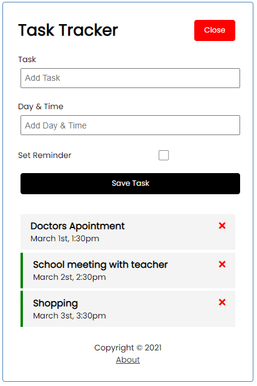

# Vue Task Tracker
> Credit to Brad Traversy on youtube, you can find the source video at [here](https://www.youtube.com/watch?v=qZXt1Aom3Cs)

## Project setup
## make sure npm is installed
```
npm install
```

### Compiles and hot-reloads for development
```
npm run serve
```

### Run the JSON-Server backend (http://localhost:5000)
```
npm run backend
```
> Now the app is running

### The home page 


### The add-task page



### Compiles and minifies for production
```
npm run build
```

### Customize configuration
See [Configuration Reference](https://cli.vuejs.org/config/).